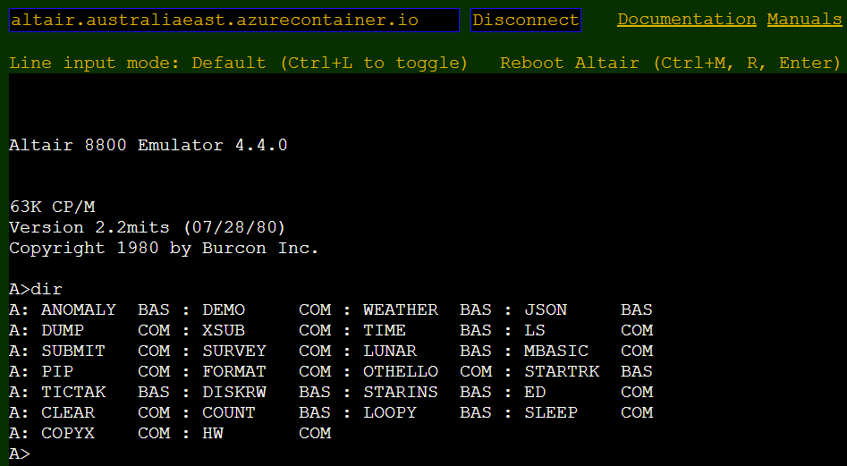

# Altair web terminal

The Altair web terminal is a remote terminal command prompt for the Altair emulator. The web terminal is a static web app and is hosted in your web browser and connects to the Altair emulator. When the web terminal connects, the Altair terminal reports the emulator and CP/M versions, and you can start to use the Altair.

The Altair web terminal url is [http://aterminal.z8.web.core.windows.net/](http://aterminal.z8.web.core.windows.net/).

Note, there are links on the web terminal to the retro games GitHub repo, the documentation, and user and programming manuals.



## Ten-minute video introduction to the Altair emulator

<iframe width="560" height="315" src="https://www.youtube.com/embed/uTBHzwm11xM" title="YouTube video player" frameborder="0" allow="accelerometer; autoplay; clipboard-write; encrypted-media; gyroscope; picture-in-picture" allowfullscreen></iframe>

## Introduction to CP/M

CP/M originally stood for Control Program/Monitor. Later, CP/M became known as Control Program for Microcomputers. It was a mass-market operating system created in 1974 for Intel 8080/85-based microcomputers by Gary Kildall of Digital Research, Inc.

The first version was single-tasking on 8-bit processors with support for up to 64 kilobytes of memory. Later versions of CP/M added multiple-user variations and were migrated to 16-bit processors.

For more information about CP/M, see the [CP/M Wikipedia article](https://en.wikipedia.org/wiki/CP/M?azure-portal=true) and [CP/M Frequently Asked Questions](http://www.gaby.de/faq.htm).

## Digital Research CP/M Operating System Manual

You will find a wealth of information about CP/M, including compilers, assemblers, debuggers, and more in the [Digital Research CP/M Operating System Manual](http://www.gaby.de/cpm/manuals/archive/cpm22htm/)

## Programming the Altair emulator

From CP/M, you can program the Altair emulator using Microsoft BASIC, BD Software C, the Intel Assembler and Linker, and the Microsoft MACRO-80 Assembler.

## Get started with CP/M

Here are some CP/M commands to get you started:

- Changing drives. The Altair emulator mounts two drives, drive A and drive B. To change drives, from the Altair CP/M command prompt in the Web Terminal, type the drive name, then press the Enter key.

    ```cpm
    a:

    b:
    ```

- Display a directory listing.

    ```cpm
    dir

    dir *.BAS

    ls
    ```

- Erase a file.

    ```cpm
    era *.txt
    ```

- Copy Microsoft BASIC `mbasic.com` from drive A to drive B.

    ```cpm
    pip newhw.com=hw.com
    ```

- List the contents of a file.

    ```cpm
    type hw.c
    ```

- Rename a file.

    ```cpm
    ren hello.c=hw.c
    ```

## Get started with retro gaming

## How to copy a retro game to the CP/M filesystem

If you configured the Altair emulator GetFile_URL to use the [Retro Games](https://github.com/AzureSphereCloudEnabledAltair8800/RetroGames) repo, then you can copy games to the Altair emulator.


The following is an example of copying the `love.bas` game to the CP/M filesystem using the CP/M `GetFile` command.

```cpm
gf love.bas
```

Note, a lot of the games depend on **MENU.BAS**, so be sure to copy MENU.BAS to the emulator.

```cpm
gf menu.bas
```

### Acknowledgments

This list of games was made possible by the dedicated work of [CP/M Games](http://www.retroarchive.org/cpm/games/games.htm) and [Vintage BASIC](http://www.vintage-basic.net/games.html).
