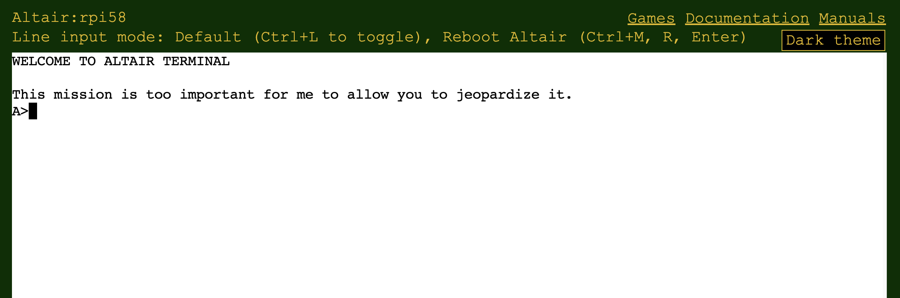

# Deploy

The easiest way to run the Altair 8800 emulator is with Docker. You need to install Docker on your Linux, macOS, Windows, or Raspberry Pi computer.

If you have a Beaglebone or prefer, you can compile the Altair code from the source code and run it as a native application on your computer. For more information, refer to [Compiling the Altair emulator](03-Compile-the-Altair/01-Introduction.md).

## Install Docker

Install Docker on your computer.

- [Install Docker Desktop on Windows](https://docs.docker.com/desktop/windows/install/)
- [Install Docker Desktop on Mac](https://docs.docker.com/desktop/mac/install/)

- Install Docker on Linux and Raspberry Pi

    Docker has a [script](https://docs.docker.com/engine/install/debian/) to install Docker on Debian, Ubuntu, and Raspberry Pi OS. Run this script using the following command.

    ```bash
     curl -fsSL https://get.docker.com -o get-docker.sh && sudo sh get-docker.sh
    ```

    Review the [Manage Docker as a non-root user](https://docs.docker.com/engine/install/linux-postinstall/#manage-docker-as-a-non-root-user) document.

    1. Grant the current user Docker rights

        ```bash
        sudo usermod -aG docker $USER
        ```

    1. Reboot the system.

## Start the Altair emulator Docker container

The Docker Altair image runs on 64 bit Linux, macOS, Windows, and Raspberry Pi OS. The Altair emulator disks are stored in a Docker persistent storage volume. This ensures any changes made to the contents of the Altair disks are saved if the Docker container is deleted.

## Pi Sense HAT LED panel

If you have a Raspberry Pi and a Pi Sense HAT, then the 8x8 LED panels can display:

1. The Altair 8800 front panel address and data bus information. The address and data bus LEDs give you a visual indication of the state of the Intel 8080 CPU.
1. The Pi Sense HAT panel can also be switched to *Font* and *bitmap* modes. When *Font* is enabled, you can display characters on the LED panels. Bitmap mode gives you control of each pixel on th 8x8 panel.

    | Raspberry Pi with Pi Sense HAT  | Raspberry Pi Sense HAT |
    |--|--|
    |  |  |

## Start the Altair Docker image

There are two Altair Docker images. The first is for general use on 64-bit (ARM64 and AMD64) [Linux, macOS, Windows and Raspberry Pi operating systems](#general-linux-macos-windows-and-raspberry-pi-users). The second image is for a Raspberry Pi running [Raspberry Pi OS with a Pi Sense HAT](#raspberry-pi-with-pi-sense-hat-users). Be sure to run the Docker image that matches your system.

### General Linux, macOS, Windows, and Raspberry Pi users

Run the following command to start the Altair emulator. This command will:

1. Create a Docker persistent storage volume.
1. Map the ports for the web terminal.
1. Set the Docker container time zone. Replace the Australia/Sydney time zone with your local time zone.

#### Create a new persistent storage volume

```bash
docker volume create altair-disks
```

#### Start the Altair emulator

```bash
docker run -e TZ=Australia/Sydney -d -p 8082:8082 -p 80:80 --name altair8800 -v altair-disks:/AltairEverywhere/AltairHL_emulator/Disks --rm glovebox/altair8800:latest
```

### Raspberry Pi with Pi Sense HAT users

Run the following command to start the Altair emulator. This command will:

1. Enable I2C hardware access.
2. Create a Docker persistent storage volume.
3. Map the ports for the web terminal.
4. Set the Docker container time zone. Replace the Australia/Sydney time zone with your local time zone.
5. Starts the Docker container in privileged mode so the emulator can control the Pi Sense HAT panel LEDs.

#### Enable I2C hardware access

From the command prompt, run the following command to enable I2C support for the Pi Sense HAT.

```bash
sudo raspi-config nonint do_i2c 0
```

#### Create a new persistent storage volume

```bash
docker volume create altair-disks
```

#### Start the Altair emulator

```bash
docker run -e TZ=Australia/Sydney -d --privileged -p 8082:8082 -p 80:80 --name altair8800 -v altair-disks:/AltairEverywhere/AltairHL_emulator/Disks --rm glovebox/altair8800-pisense:latest
```

### Managing the Docker persistent storage volume

1. Inspect the persistent storage volume

    ```bash
    docker volume inspect altair-disks
    ```

2. Check the data in the persistent storage volume

    ```bash
    sudo ls /var/lib/docker/volumes/altair-disks/_data -all
    ```

3. To remove the persistent storage volume.

   ```bash
   docker volume rm azure-sql-edge-data
   ```

## Open the Web Terminal

Open the Web Terminal to access the Altair emulator. Follow these steps.

1. Familiarize yourself with the [Web Terminal](../start/20-Web-Terminal.md) and the CP/M operating system.
1. Open your web browser:
    * Navigate to `http://localhost` if you deployed the Altair emulator on your local computer.
    * Navigate to `http://hostname_or_ip_address` if you deployed the Altair emulator on a remote computer.
1. Connect to the Altair emulator, enter the `localhost`, the `Hostname` or the `IP address` of the computer running the Altair emulator.
1. Select **Connect**. Once connected, you will be greeted by the CP/M command prompt.

    

## Stop the Altair emulator Docker container

Use the following command to stop the Altair emulator Docker container.

```bash
docker stop altair8800
```

## Restart the Altair emulator Docker container

Use the following command to start the Altair emulator Docker container that you previously stopped.

```bash
docker start altair8800
```

## Delete the Altair emulator Docker container

First, stop the Altair emulator Docker container, then delete the Altair emulator container.

**WARNING** Deleting the Altair emulator Docker container will also delete any data and programs you have stored on the Altair.

Use the following command to delete the Altair Docker container.

```bash
docker container rm altair8800
```

## Trouble shooting Raspberry Pi issues

1. Ensure strong WiFi connection
1. Disabling the WiFi power management can improve stability

    ```bash
    sudo iw wlan0 set power_save off
    ```
